# 🔨 Behavioral Analysis of Bid Patterns on Online Auctions

Unsupervised clustering of eBay auction bidding behavior to detect potential **shill bidding** (fraudulent price inflation) using **K-Means** and **Agglomerative (Hierarchical) Clustering**. Both algorithms independently identified a high-risk bidder group with an 86% win rate and abnormally concentrated bidding focus — a signature consistent with shill bidding.

> **TL;DR** — Can we detect auction fraud without labeled data? Yes. Both K-Means and Agglomerative clustering found 3 distinct behavioral profiles: regular bidders (~48–55%), passive/explorer bidders (~33–40%), and a suspicious high-risk group (~11–12%) exhibiting shill bidding characteristics.

---

## 📂 Repo Structure

```
├── dataset/
│   └── Shill_Bidding_Dataset.csv   # 6,321 observations × 13 features (UCI)
├── assets/                         # README images (plots & code screenshots)
├── clustering.ipynb                # Full Python implementation
└── README.md
```

---

## 📊 Dataset

| Property | Value |
|----------|-------|
| **Source** | [UCI Machine Learning Repository — Shill Bidding Dataset](https://doi.org/10.24432/C5Z611) |
| **Rows** | 6,321 bidding activities |
| **Columns** | 13 features |
| **Missing Values** | None |
| **Origin** | Scraped from eBay auctions of a popular product |

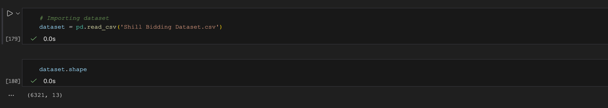

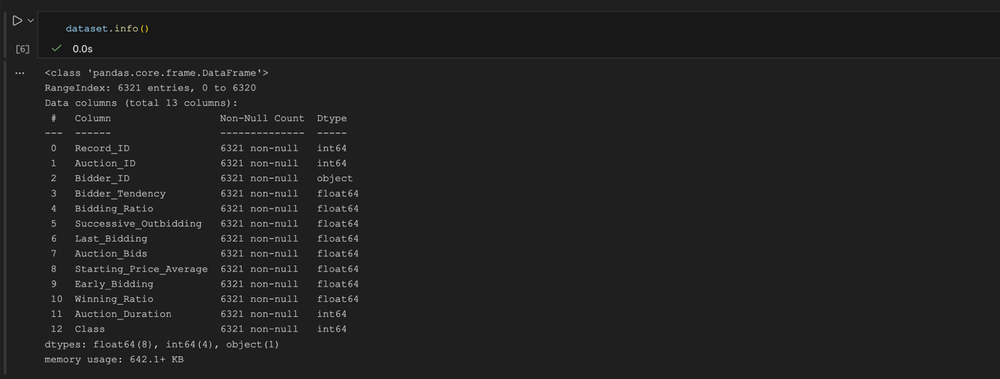

The dataset contains 12 numerical variables and 1 categorical variable. It also includes a `Class` label (binary), but since this is an **unsupervised learning exercise**, the class label is excluded from training and only used for optional cluster evaluation.

### Feature Breakdown

**Behavioral features (used for clustering):**

| Feature | Type | Description |
|---------|------|-------------|
| `Bidder_Tendency` | Continuous | Tendency to bid from a particular seller |
| `Bidding_Ratio` | Continuous | Rate at which a bidder bids during the auction |
| `Successive_Outbidding` | Continuous | Rate of outbidding a particular bidder |
| `Last_Bidding` | Continuous | Proportion of closing bids by the bidder |
| `Auction_Bids` | Continuous | Total bidding rate for a particular auction |
| `Starting_Price_Average` | Continuous | Normalized starting price (multiple low starts = suspicious) |
| `Early_Bidding` | Continuous | Proportion of opening bids by the bidder |
| `Winning_Ratio` | Continuous | Ratio of auctions won |
| `Auction_Duration` | Discrete | Duration of the auction in days |

**Excluded features (identifiers / label):**

| Feature | Reason for Exclusion |
|---------|---------------------|
| `Record_ID` | Identifier — no behavioral signal |
| `Auction_ID` | Identifier — no behavioral signal |
| `Bidder_ID` | Categorical identifier |
| `Class` | Supervised label — excluded for unsupervised clustering |

---

## 🔧 Setup & Dependencies

```bash
pip install pandas numpy matplotlib seaborn scikit-learn scipy
```

```python
import pandas as pd
import numpy as np
import matplotlib.pyplot as plt
import seaborn as sns
from sklearn.preprocessing import StandardScaler
from sklearn.feature_selection import VarianceThreshold
from sklearn.cluster import KMeans, AgglomerativeClustering
from sklearn.decomposition import PCA
from sklearn.metrics import silhouette_score
from scipy.cluster.hierarchy import dendrogram, linkage
```

---

## 🔍 Exploratory Data Analysis (EDA)

### Descriptive Statistics

Initial statistics reveal that most auctions last 4–5 days, with visible variation in bidder success rates. All behavioral features are continuous and normalized between 0 and 1 (except `Auction_Duration`).

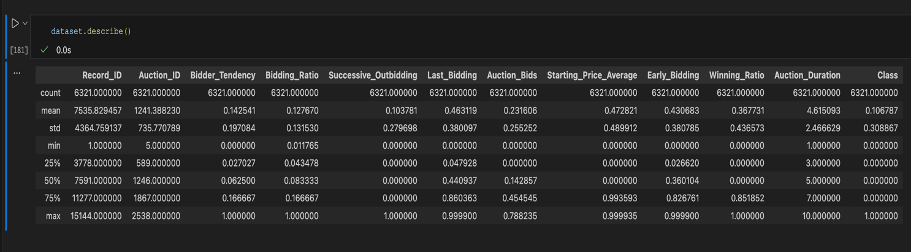

### Feature Selection — Phase 1: Remove Identifiers

The first step stripped the dataset down to only the continuous behavioral features, dropping `Record_ID`, `Auction_ID`, `Bidder_ID`, and the `Class` label. This is critical because identifiers carry no behavioral signal and would add noise to distance-based clustering.

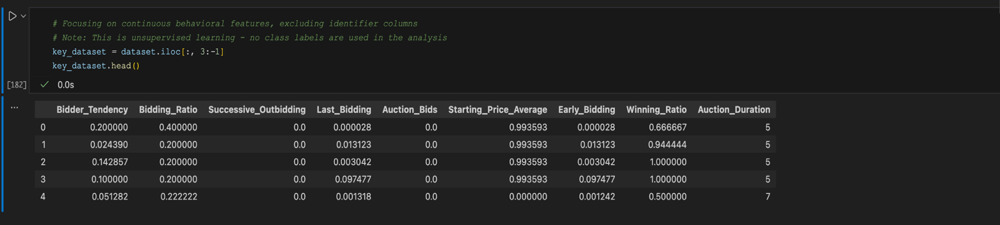

### Pairplot — Checking for Natural Clusters

A pairplot was run across the core features to check for naturally forming clusters and distribution characteristics.


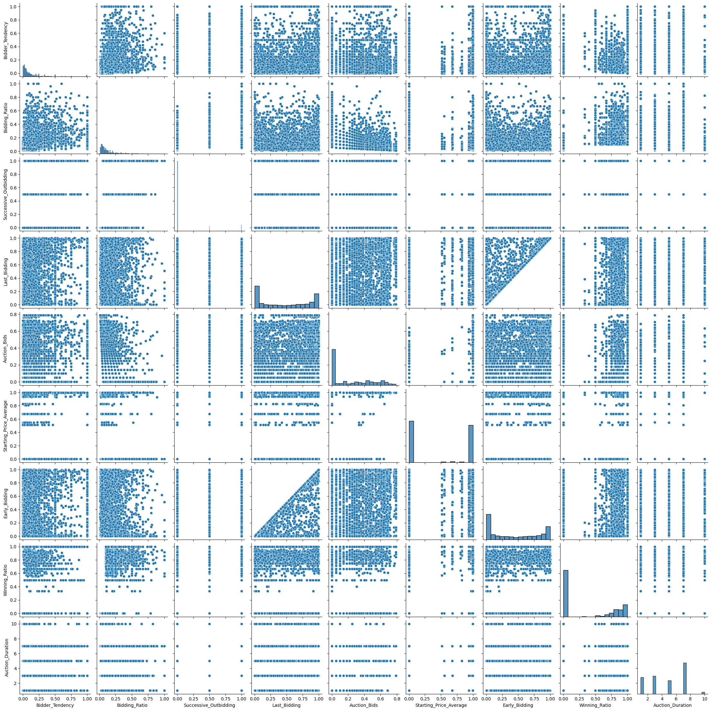

**Findings:**
- Most features show **heavily right-skewed distributions with peaks at 0**, meaning the majority of bidders show low activity across most metrics
- Very few outliers exist in the upper ranges
- **No naturally forming clusters** are visible in the pairwise scatterplots — this confirms that algorithmic clustering is needed rather than simple visual grouping

> **Why this matters:** The skewed distributions indicate that most bidders are passive or casual, with a small minority showing extreme behavior. This is exactly the pattern you'd expect if shill bidders exist — they'd be a small, behaviorally distinct subgroup buried in the data.

### Correlation Analysis

A Spearman correlation heatmap was generated to identify redundant features and understand inter-feature relationships.

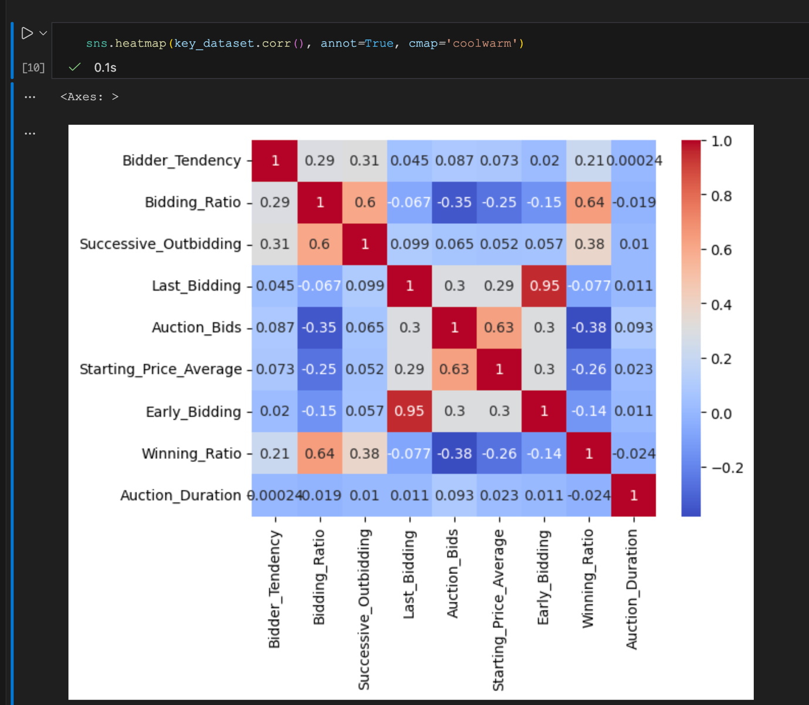

**Key findings:**
- **`Early_Bidding` ↔ `Last_Bidding`: ~95% correlation** — These features are near-duplicates. Keeping both would introduce multicollinearity, distorting distance calculations in both K-Means and Agglomerative clustering. **Decision: `Early_Bidding` was dropped.**
- **`Successive_Outbidding` ↔ `Winning_Ratio`: moderate positive correlation** — This makes intuitive sense: outbidding others frequently does lead to winning more auctions. However, these features capture different aspects of behavior (aggression vs. outcome), so both were retained.
- All other features appear independent of each other.

### Feature Selection — Phase 2: Variance Threshold

After dropping the correlated feature, a `VarianceThreshold` was applied to identify and remove any **zero-variance features** (features where every observation has the same value). These contribute nothing to clustering because they create no distance between points.

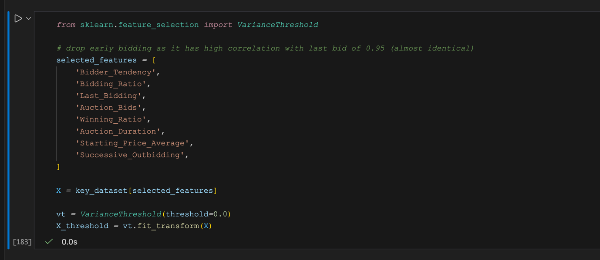

### Feature Scaling

`StandardScaler` was applied to standardize all features to mean=0, std=1. This is **essential** for distance-based algorithms (both K-Means and Agglomerative) because unscaled features with larger ranges would dominate the distance calculations.

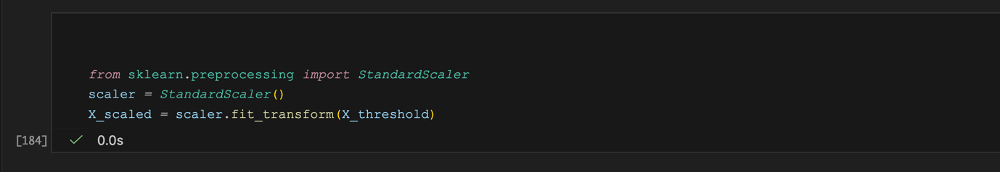

> **Why minimal preprocessing?** Unlike supervised learning, this unsupervised task has no missing values, no target encoding, and no train-test split. The key priority was retaining all behavioral information while ensuring features contribute equally to distance metrics.

---

## 🛠️ Implementation

### Why These Algorithms?

| Algorithm | Strengths | Weaknesses | Why Selected |
|-----------|-----------|------------|-------------|
| **K-Means** | Fast, simple, interpretable, effective on large datasets | Relies on choosing K upfront, sensitive to initialization | Good baseline; centroid-based approach is straightforward to profile |
| **Agglomerative** | No need to specify K upfront (uses it as termination), deterministic, reveals hierarchical structure | Computationally heavier | Validates K-Means findings from a different perspective; bottom-up merging can reveal structure K-Means misses |

### Model 1: K-Means Clustering

#### Finding Optimal K

**Elbow Method:**

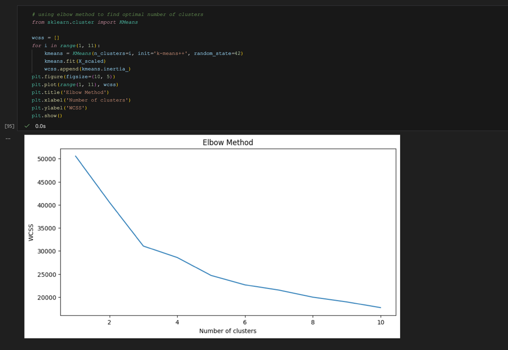

The elbow plot shows a sharp decline from K=1 to K=3, but the bend is ambiguous — it could also be interpreted as K=5. The elbow method alone is **non-deterministic** here.

**Silhouette Scores (tiebreaker):**

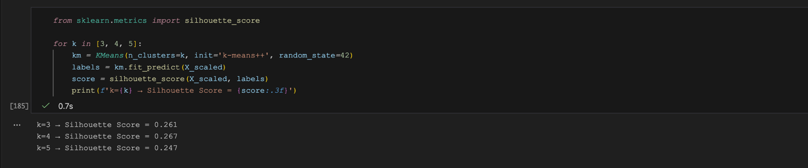

K=3 and K=4 had very close silhouette scores. Both were experimented with:

**K=4 — Rejected:** When trained with K=4, the resulting clusters were non-deterministic across runs and hard to interpret. The fourth cluster didn't represent a meaningfully distinct behavioral profile.

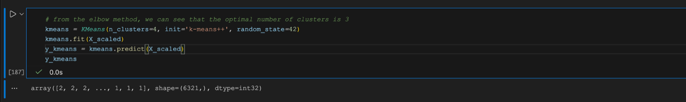

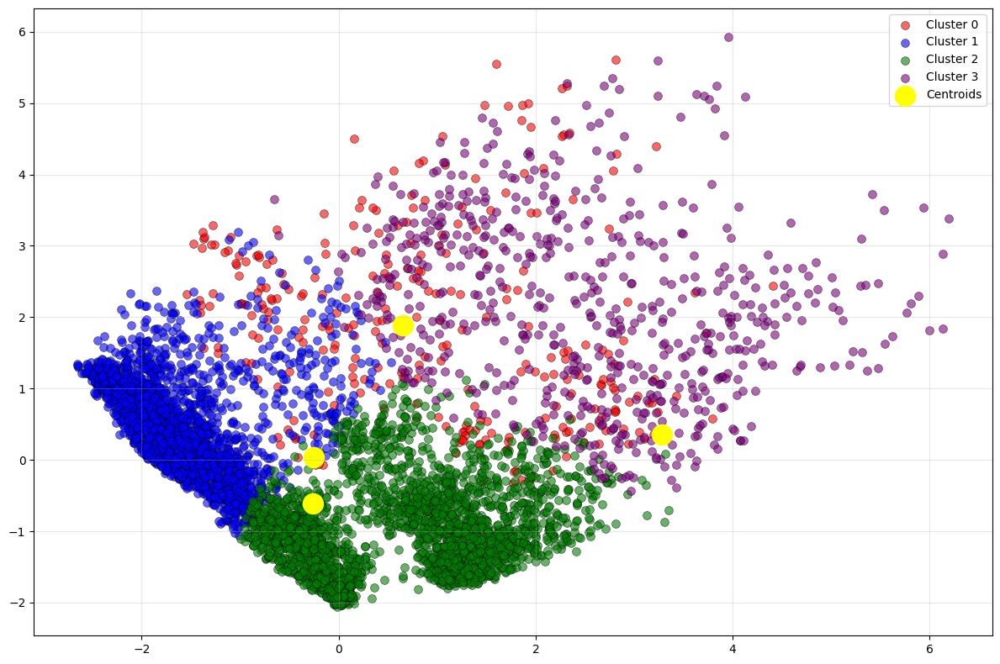

**K=3 — Selected:** Produced stable, interpretable, and distinct behavioral profiles across runs.

#### PCA for Visualization

PCA was applied **only for visualization** (not for training). The 8 behavioral features were reduced to 2 principal components to enable 2D scatter plots of the clusters.

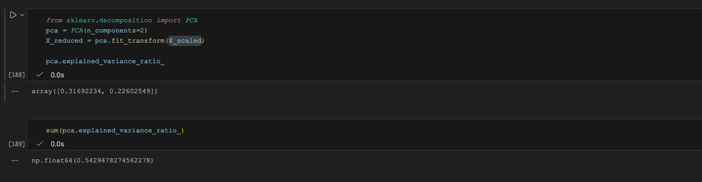

#### K-Means K=3 Results

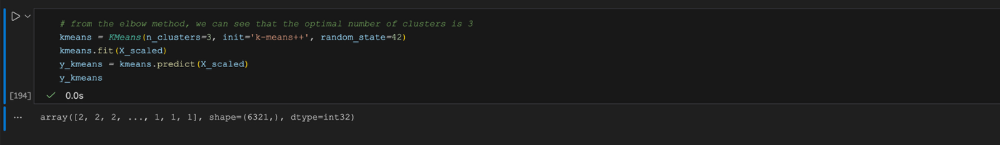

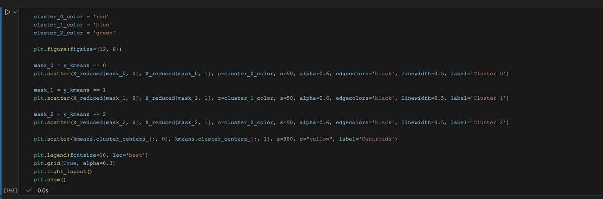

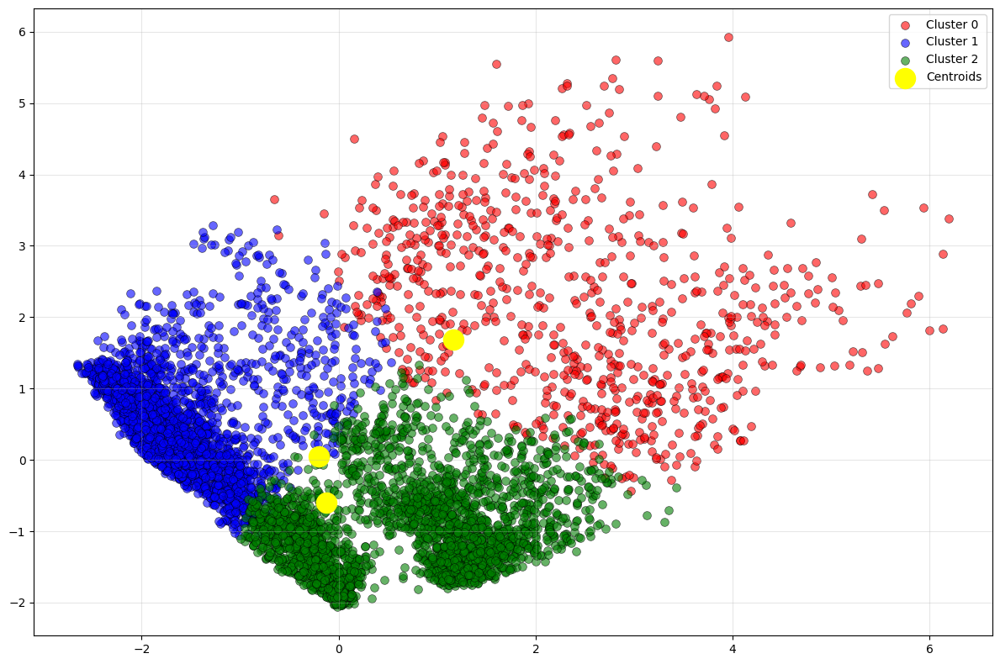

---

### Model 2: Agglomerative (Hierarchical) Clustering

#### Dendrogram

A dendrogram was plotted to inspect how clusters merge at different distance thresholds. The visual cut suggests **3 clusters**.

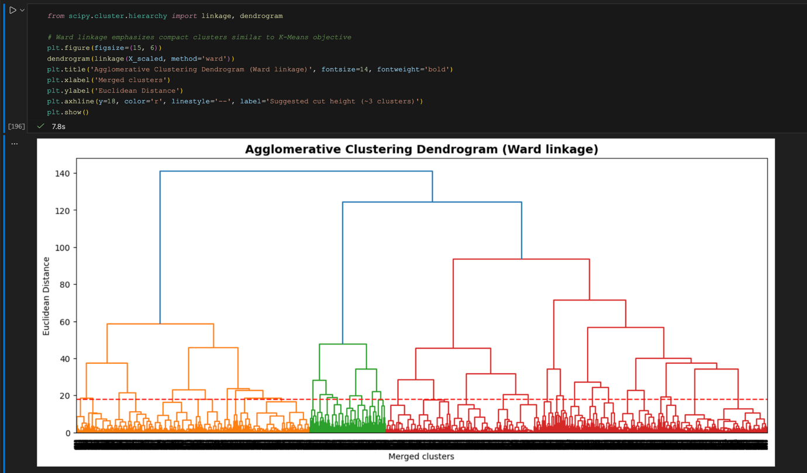

#### Silhouette Confirmation

Silhouette scores confirmed K=3 as optimal for the agglomerative approach as well.

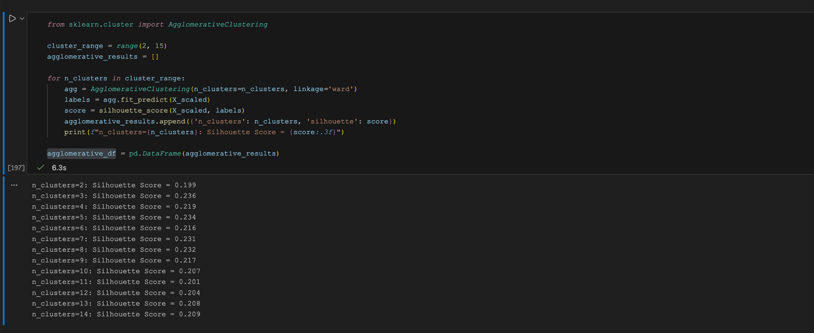

#### Agglomerative K=3 Results

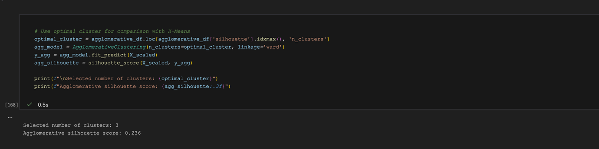

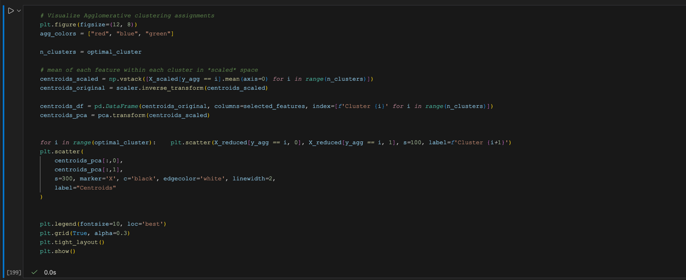

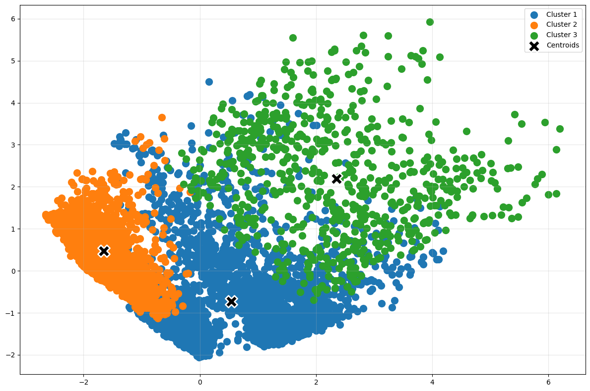

---

## 📈 Results & Cluster Profiling

### K-Means Cluster Profiles

**Silhouette Score: 0.261** — moderate separation with balanced cluster distribution.

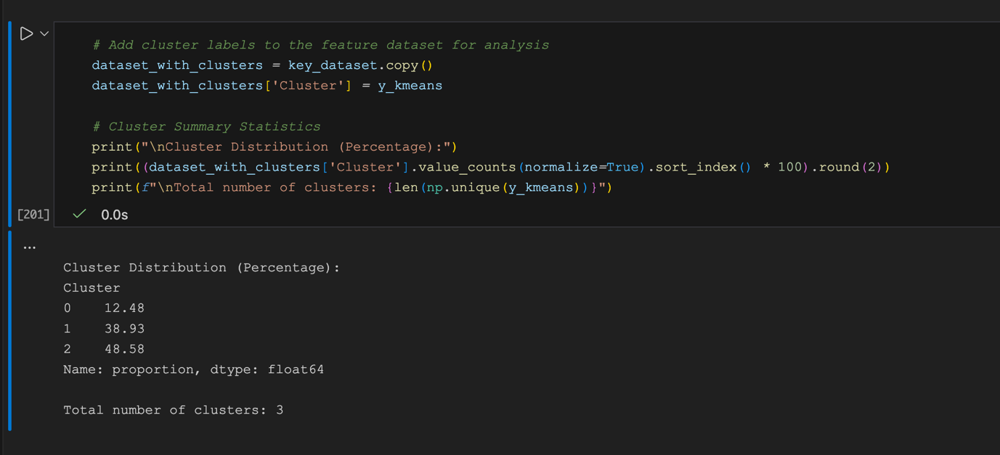

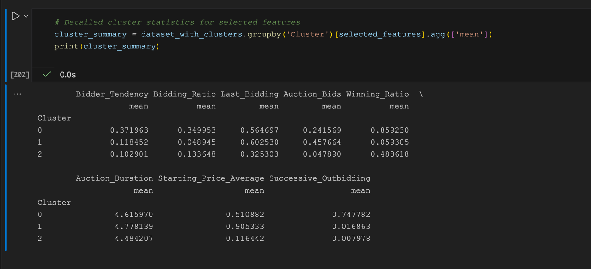

| Metric | Cluster 0 | Cluster 1 | Cluster 2 |
|--------|-----------|-----------|-----------|
| **% of Data** | **12.48%** | 39.70% | 47.82% |
| Auction Bids | 0.242 | 0.458 | 0.049 |
| Bidder Tendency | 0.372 | 0.118 | 0.103 |
| Bidding Ratio | 0.349 | 0.049 | 0.134 |
| Starting Price Avg | 0.511 | 0.905 | 0.116 |
| **Winning Ratio** | **0.859** | 0.059 | 0.489 |
| **Successive Outbidding** | **0.748** | 0.017 | 0.001 |
| Last Bid | 0.565 | 0.602 | 0.325 |
| Auction Duration | 4.748 | 4.567 | 4.642 |

#### 🚨 Cluster 0 — Aggressive Winners / Possible Shill Bidders (12.48%)

Only 789 out of 6,321 observations, but they win **86% of auctions** they enter. The signature red flags:
- **Successive outbidding ratio of 0.748** — constantly outbidding the same auctioneer, a classic shill tactic to inflate prices
- **Highest bidding ratio (0.349)** — concentrated bids on specific auctions
- **Extreme win rate (0.859)** — legitimate bidders rarely achieve this consistency
- This combination of high focus + high aggression + high wins is textbook shill bidding behavior

#### 🛋️ Cluster 1 — Passive / High-Value Browsers (39.70%)

Participate in high-value auctions (starting price avg: 0.905) but rarely win (0.059) and almost never outbid others (0.017). These are casual participants who browse expensive items but don't aggressively compete.

#### ✅ Cluster 2 — Regular Bidders (47.82%)

The largest group — everyday auction participants. They focus on affordable items (starting price: 0.116), have a moderate ~50% win ratio, and show virtually no successive outbidding (0.001). This is what normal auction behavior looks like.

---

### Agglomerative Cluster Profiles

**Silhouette Score: 0.236** — slightly lower than K-Means but with more defined cluster sizes.

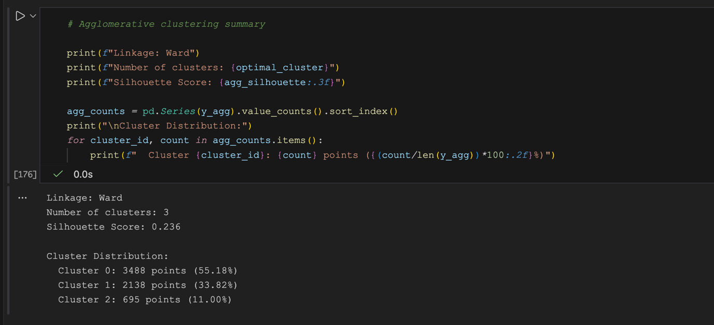

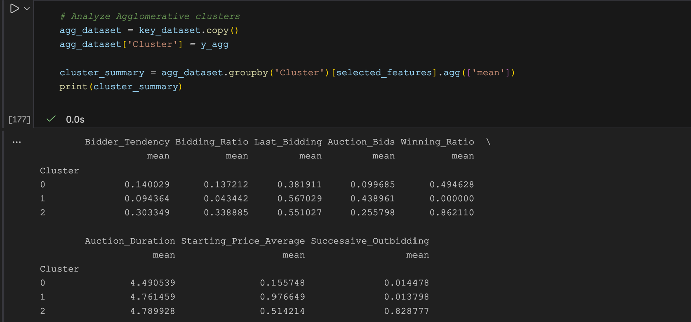

| Metric | Cluster 0 | Cluster 1 | Cluster 2 |
|--------|-----------|-----------|-----------|
| **% of Data** | 55.22% | 33.65% | **11.13%** |
| Auction Bids | 0.100 | 0.439 | 0.256 |
| Bidder Tendency | 0.140 | 0.094 | 0.303 |
| Bidding Ratio | 0.137 | 0.043 | 0.339 |
| Starting Price Avg | 0.156 | 0.977 | 0.514 |
| **Winning Ratio** | 0.495 | 0.000 | **0.862** |
| **Successive Outbidding** | 0.014 | 0.014 | **0.829** |
| Last Bid | 0.382 | 0.567 | 0.551 |
| Auction Duration | 4.491 | 4.761 | 4.790 |

#### ✅ Cluster 0 — Regular Bidders (55.22%)

Mirrors K-Means Cluster 2. Affordable items (0.156), ~50% win rate, negligible outbidding.

#### 👀 Cluster 1 — Explorers / Window Shoppers (33.65%)

A new behavioral profile not surfaced by K-Means: **0% win rate** despite participating in the highest-value auctions (starting price: 0.977). These people browse expensive items with no intention to buy.

#### 🚨 Cluster 2 — Aggressive Winners / Possible Shill Bidders (11.13%)

Nearly identical profile to K-Means Cluster 0: **86.2% win rate**, **0.829 successive outbidding**, **0.339 bidding ratio**. The same suspicious pattern independently confirmed by a completely different algorithm.

---

## ⚖️ Model Comparison

| Criteria | K-Means | Agglomerative |
|----------|---------|---------------|
| **Silhouette Score** | **0.261** | 0.236 |
| Optimal K | 3 | 3 |
| High-Risk Group Size | 12.48% (789) | 11.13% (703) |
| High-Risk Win Rate | 85.9% | 86.2% |
| High-Risk Outbidding | 0.748 | 0.829 |
| Execution Speed | **Faster** | Slower |
| Unique Discovery | — | Explorer/window-shopper group (0% wins) |
| **Verdict** | **Slight edge** (higher silhouette, faster, balanced clusters) | Validates K-Means + reveals explorer behavior |

> Both algorithms independently found the same shill bidding signature — ~11–12% of bidders winning 86% of their auctions with extreme outbidding concentration. This cross-validation between two fundamentally different approaches strengthens the finding.

---

## 💡 Suggestions & Business Applications

### Real-Time Fraud Detection System

Assign incoming bidders to clusters in real-time during auctions:
- **K-Means Cluster 0 / Agglomerative Cluster 2** → 🚨 **High Risk** — flag for immediate review
- **Agglomerative Cluster 1** → ⚠️ **Low Risk** — time-wasters, not fraudulent but worth monitoring
- **All other clusters** → ✅ **Normal** — no intervention needed

This reduces manual review load by focusing investigation on only ~12% of bidders.

### Fraud Deterrence

- **Automated alerts & temporary suspensions** when bidding patterns match the high-risk cluster profile
- **Public announcement** of the fraud detection system to increase buyer trust and deter shill bidders proactively
- Track bidder cluster migration over time — a regular bidder shifting toward high-risk patterns is an early warning signal

---

## ⚠️ Limitations

| Limitation | Impact |
|-----------|--------|
| **Moderate silhouette scores (0.24–0.26)** | Clusters have some overlap; separation isn't perfectly clean |
| **Not proof of fraud** | Clusters identify suspicious *patterns*, not confirmed shill bidding — human verification is still required |
| **Static analysis** | Models were trained on a snapshot; real shill bidders adapt their strategies over time |
| **Single product category** | Dataset was scraped from auctions of one popular product — behavioral patterns may differ for other categories |
| **Ethical concerns** | Data was web-scraped without explicit participant consent (mitigated by anonymized bidder/product IDs) |

---

## 🏃 Quick Start

```bash
# 1. Clone the repo
git clone https://github.com/SapeleD3/Behavioral-analysis-of-bid-patterns-on-online-auction.git
cd Behavioral-analysis-of-bid-patterns-on-online-auction

# 2. Install dependencies
pip install pandas numpy matplotlib seaborn scikit-learn scipy

# 3. Run the notebook
jupyter notebook clustering.ipynb
```

---

## 📚 References

- Shill Bidding Dataset. (2020). [UCI Machine Learning Repository](https://doi.org/10.24432/C5Z611).
- Dong, F., Shatz, S. M., & Xu, H. (2012). Combating online in-auction fraud: Clues, techniques and challenges. *Computer Science Review*.
